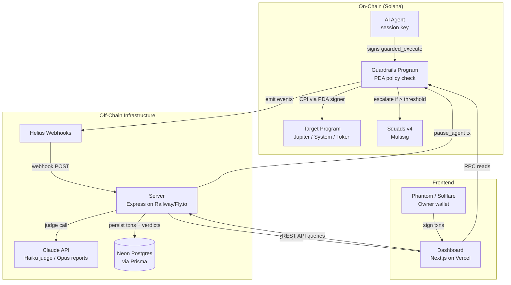

# Agent Guardrails Protocol

**On-chain policy enforcement for Solana AI agents.** Three layers of defense — program allow-listing, spending budgets, and a real-time AI kill switch — between any autonomous agent and the blockchain.

Built for [Solana Frontier](https://www.colosseum.org/) hackathon.

---

## The Problem

250,000+ AI agents operate on Solana today. Most hold unconstrained keys — if compromised, there's nothing on-chain stopping them from draining their treasury. Step Finance lost $40M to exactly this kind of failure.

## The Solution

Agent Guardrails Protocol is an on-chain policy layer that sits between an AI agent and the programs it calls. Every transaction goes through a `guarded_execute` instruction that enforces:

1. **Allow-listing** — agent can only call whitelisted programs
2. **Spending budgets** — per-transaction and rolling daily caps
3. **AI kill switch** — a monitoring server watches all activity in real time, uses Claude to judge anomalies, and can pause an agent on-chain in under 3 seconds

```
Agent signs txn → Guardrails PDA validates → CPI to target program
                                                    ↓ (events)
                              Helius webhook → Server → Claude judge
                                                    ↓ (if suspicious)
                                              On-chain PAUSE
```

## Architecture



## Tech Stack

| Layer | Technology |
|---|---|
| Smart contract | Anchor 0.30.1 / Rust |
| Frontend | Next.js 14 (App Router) / Tailwind / shadcn/ui / Recharts |
| Wallet | @solana/wallet-adapter (Phantom, Solflare, Backpack) + SIWS |
| State management | TanStack Query |
| Server | Express + Node.js 20 / TypeScript on Railway/Fly.io |
| Anomaly detection | Claude Haiku 4.5 (real-time) + Claude Opus 4.7 (incident reports) |
| Data ingestion | Helius Enhanced Webhooks |
| Database | Neon Postgres + Prisma ORM |
| Realtime | Server-Sent Events (SSE) |
| Session keys | Swig |
| Multisig escalation | Squads v4 |
| Testing | LiteSVM (in-process) via anchor-litesvm |

## Repository Structure

Four isolated sub-projects — no monorepo, each deploys independently:

```
agent-guardrails/
├── program/              # Anchor/Rust on-chain program → Solana devnet
├── sdk/                  # IDL + TS client (source of truth, synced to consumers)
├── server/               # Express server: API + worker pipeline → Railway/Fly.io
├── dashboard/            # Next.js 14 frontend only → Vercel
├── docs/                 # Architecture, data contracts, setup, deploy, demo runbook
├── scripts/              # SDK sync, devnet deploy
├── .github/workflows/    # CI + deploy workflows
└── .claude/              # Custom commands + specialized agents for Claude Code
```

Shared SDK is synced automatically — edit `sdk/`, a pre-commit hook copies to `server/src/sdk/` and `dashboard/lib/sdk/`.

## Quick Start

### Prerequisites

- Rust 1.75+, Solana CLI 1.18+, Anchor 0.30.1
- Node.js 20+, pnpm 9+

### Setup

```bash
git clone https://github.com/iamasx/agent-guardrails.git
cd agent-guardrails

# Configure git hooks (auto-syncs SDK on commit)
git config core.hooksPath .githooks

# Build the program
cd program
pnpm install
anchor build
cd ..

# Sync IDL to consumers
bash scripts/sync-sdk.sh

# Run tests (LiteSVM, in-process — no validator needed)
cd program
anchor test --skip-local-validator --skip-deploy
```

### Run the Server

```bash
cd server
pnpm install
cp .env.example .env          # fill in values (DATABASE_URL, ANTHROPIC_API_KEY, etc.)
npx prisma migrate dev        # create database tables
pnpm dev                      # http://localhost:8080
```

### Run the Dashboard

```bash
cd dashboard
npm install
cp .env.example .env.local    # fill in values (NEXT_PUBLIC_API_URL, etc.)
npm run dev                    # http://localhost:3000
```

See [docs/env-setup.md](docs/env-setup.md) for the full local development guide.

## How the On-Chain Program Works

The core is `guarded_execute` — a single instruction that validates and proxies agent transactions:

1. Load the agent's `PermissionPolicy` PDA
2. Assert the policy is active (not paused)
3. Assert the session hasn't expired
4. Assert the target program is whitelisted
5. Assert the transaction amount is within the per-tx cap
6. Roll the daily budget if 24h has elapsed
7. Assert the daily budget isn't exceeded
8. If amount exceeds the escalation threshold and Squads is configured, create a multisig proposal
9. Emit a `GuardedTxnAttempted` event
10. CPI to the target program with the PDA as signer
11. Update the `SpendTracker`
12. Emit `GuardedTxnExecuted` or `GuardedTxnRejected`

The agent's keypair holds no funds. All funds live in token accounts owned by the policy PDA. The agent instructs, the PDA acts.

## How the AI Judge Works

```
Helius webhook → Server
    → [Ingest] HMAC verify, parse, persist via Prisma → SSE push
    → [Prefilter] Cheap stat checks — skip LLM for routine txns (~70% skipped)
    → [Judge] Claude Haiku evaluates: ALLOW / FLAG / PAUSE → SSE push
    → [Executor] If PAUSE: sign + send pause_agent on-chain → SSE push
    → [Reporter] Queue Claude Opus incident report (async) → SSE push
```

**Prefilter rules** (skips LLM if all hold):
- Target is the agent's most-used program
- Amount < 50% of cap
- < 3 txns in last 60 seconds
- Within historical activity hours

**Always invokes LLM if any hold:**
- New program never seen before
- Amount > 70% of cap
- Burst > 5 txns in 60s
- Daily budget > 80% consumed
- Session expiring within 10 minutes

## Deployment

| Component | Platform | Command |
|---|---|---|
| Program | Solana devnet | `cd program && anchor deploy` |
| Database | Neon Postgres | `cd server && npx prisma migrate deploy` |
| Server | Railway/Fly.io | `cd server && fly deploy` or `railway up` |
| Dashboard | Vercel | Auto-deploys on push to main |

Deploy order matters: **Program** (need program ID) → **Database** (need connection string) → **Server** (need program ID + DB + webhook URL) → **Dashboard** (need server URL).

See [docs/deploy.md](docs/deploy.md) for the full deployment guide.

## Sponsor Integrations

- **[Swig](https://swig.so/)** — Session key issuance. Scoped agent keys with built-in expiry. Defense in depth with Guardrails.
- **[Squads v4](https://squads.so/)** — Multisig escalation. High-value transactions require human approval via Squads proposal.
- **[Helius](https://helius.dev/)** — Enhanced webhooks stream program events to the monitoring server in real time.
- **[Solana Agent Kit](https://github.com/sendai/solana-agent-kit)** (SendAI) — Demo agents simulate honest and malicious behavior for the live demo.

## Demo

Three agents run on devnet:
1. **Yield Bot** — honest Jupiter swaps, ~30 txns/hour
2. **Staking Agent** — honest Marinade staking
3. **Alpha Scanner** — deliberately misbehaves (burst txns to unknown programs)

```bash
cd dashboard
npm run demo:setup       # Create policies on devnet
npm run demo:simulate    # Start agents — attacker triggers at T+60s
```

The dashboard shows normal activity streaming in via SSE, then the attack: FLAG → FLAG → PAUSE in real time. The agent is stopped on-chain in under 3 seconds. An Opus-generated incident report appears with a full timeline and root cause analysis.

## Documentation

| Document | Description |
|---|---|
| [implementation-plan.md](implementation-plan.md) | High-level spec, week plan, demo script, risks |
| [program/IMPLEMENTATION.md](program/IMPLEMENTATION.md) | On-chain program design |
| [server/IMPLEMENTATION.md](server/IMPLEMENTATION.md) | Server pipeline, API, SSE, auth |
| [dashboard/IMPLEMENTATION.md](dashboard/IMPLEMENTATION.md) | Frontend components, data fetching, SSE |
| [docs/architecture.md](docs/architecture.md) | System topology and data flow diagrams |
| [docs/data-contracts.md](docs/data-contracts.md) | Account layouts, events, Prisma schemas, API contracts |
| [docs/env-setup.md](docs/env-setup.md) | Local development setup guide |
| [docs/deploy.md](docs/deploy.md) | Deployment guide for all components |
| [docs/demo-runbook.md](docs/demo-runbook.md) | Demo day operator's guide |

## License

MIT

---

Built with [Claude Code](https://claude.ai/code)
