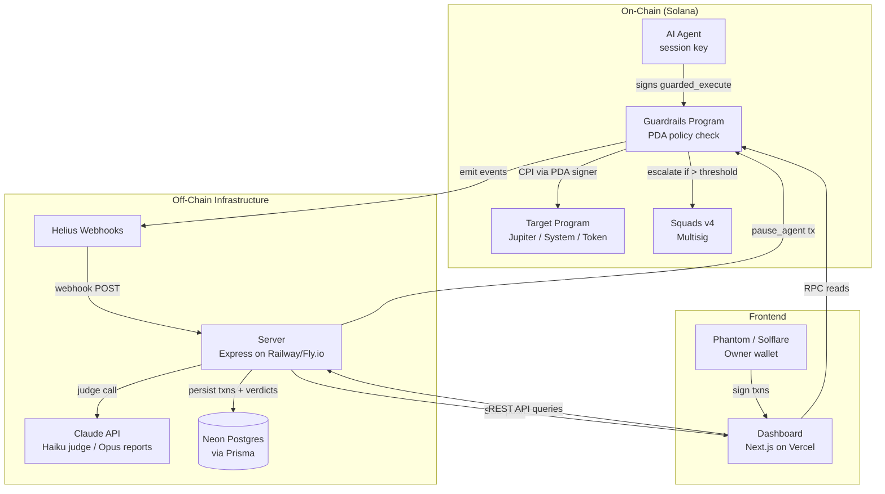
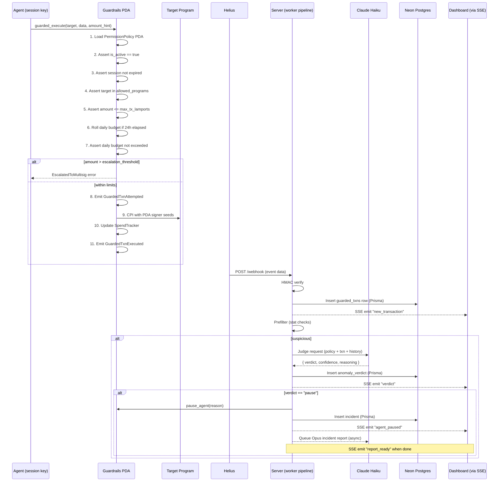
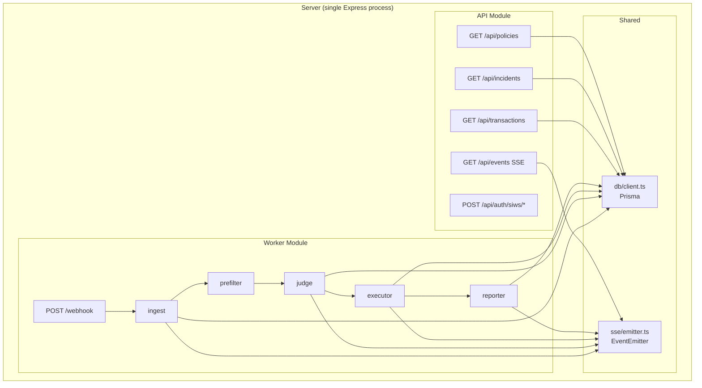

# Architecture

## System Topology

## guarded_execute Transaction Lifecycle

## Server Architecture

## SDK Sync Flow

**Rule:** Never edit `server/src/sdk/` or `dashboard/lib/sdk/` directly. Always edit `sdk/` and run `bash scripts/sync-sdk.sh`.
